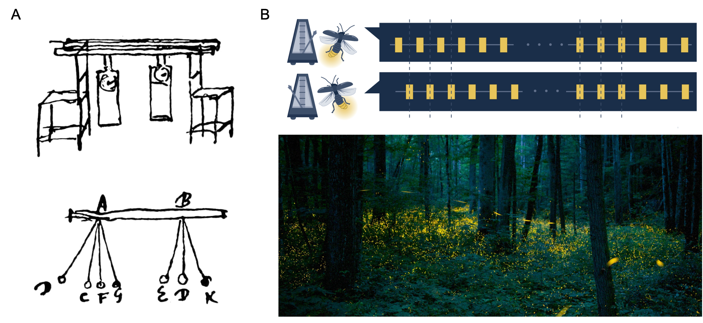
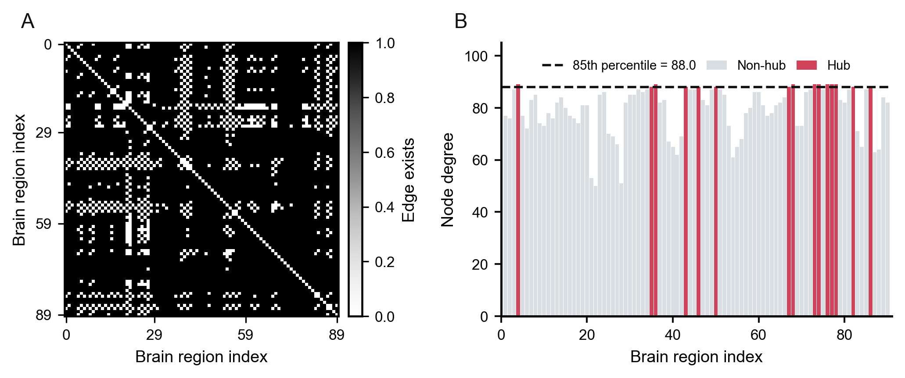

# Modeling the Emergent Synchronization of Brain Networks with Kuramoto Model

Final project for MMLS 2026 spring, PKU, taught by Prof. Tao and Prof. Champer.

## Headpic

| Synchronization phenomena | AAL connectome construction |
| --- | --- |
|  |  |
| Historical and biological examples of synchronization, from coupled clocks to burst flashing. | Construction of the empirical AAL-90 structural connectome and identification of high-degree hubs. |

## Abstract

Synchronization is a universal phenomenon observed in systems ranging from firefly swarms to circadian clocks and neuronal populations. In the brain, synchronized neural activity plays a crucial role in information processing, cognition, and behavior, while abnormal synchronization is associated with neurological disorders. Here, we investigate the emergence of large-scale brain synchronization using the Kuramoto model on a structural connectome derived from the Automated Anatomical Labeling (AAL) atlas. Based on it, we construct a dynamical model and reproduce the collective synchronization, demonstrating that the phenomenon is strictly governed by the coupling parameter. Building on this physical baseline, we systematically investigate the topological drivers of the system, revealing the disproportionate role of network hubs in facilitating global phase transitions and evaluating the network's dynamical vulnerability to localized structural perturbations. We further extend this framework to circadian resynchronization, using a forced Kuramoto model to illustrate how coupled neural oscillators recover coherence after abrupt time-zone phase shifts. Finally, we translate these theoretical insights into a clinical context by comparing empirical connectome data from Alzheimer's disease patients and healthy controls elucidating the clinical significance of disrupted synchronization dynamics.

## Code Availability and Annotations

MATLAB and Python files with the same name implement the same analysis or visualization logic.

| Path | Summary |
| --- | --- |
| `Code/Kuramoto_demo/Kuramoto_rotor.m` / `.py` | Interactive-style Kuramoto rotor demonstration showing oscillator phases, order parameter dynamics, and burst activity. |
| `Code/Kuramoto_demo/Kuramoto_transition.m` / `.py` | Mean-field transition and finite-size simulation of the classical Kuramoto synchronization bifurcation. |
| `Code/Kuramoto_demo/Kuramoto_network_topology.m` / `.py` | Comparison of synchronization thresholds on global, Erdős-Rényi, and Barabási-Albert network topologies. |
| `Code/Brain_Kuramoto/Brain_connectome.m` / `.py` | Construction and visualization of the AAL-90 group consensus structural connectome and hub degree distribution. |
| `Code/Brain_Kuramoto/Brain_sync.m` / `.py` | Brain-network synchronization parameter scans, module and hub synchronization analysis, and focal perturbation entrainment figures. |
| `Code/Brain_Kuramoto/Brain_disease.m` / `.py` | Alzheimer's disease continuum analysis using empirical connectome matrices, topological lesion regression, and perturbation-rescue simulation. |
| `Code/Brain_Kuramoto/Brain_circadian.m` / `.py` | Forced Kuramoto/Ott-Antonsen circadian resynchronization model for jet-lag recovery dynamics. |
| `Code/Brain_Kuramoto/data/rawdata.mat` | Multi-subject AAL-90 structural connectivity tensor used to build the healthy group consensus connectome. |
| `Code/Brain_Kuramoto/data/CN/*.csv` | Cognitively normal ADNI structural connectivity matrices. |
| `Code/Brain_Kuramoto/data/EMCI/*.csv` | Early mild cognitive impairment ADNI structural connectivity matrices. |
| `Code/Brain_Kuramoto/data/LMCI/*.csv` | Late mild cognitive impairment ADNI structural connectivity matrices. |
| `Code/Brain_Kuramoto/data/AD/*.csv` | Alzheimer's disease ADNI structural connectivity matrices. |
| `Report/Figs/*.png` | Final report figures generated from the project scripts and preserved for the online page and manuscript. |

## Extensive Online Page

[https://junfenglyu.github.io/Brain_Synchronization_Kuramoto/](https://junfenglyu.github.io/Brain_Synchronization_Kuramoto/)

The online page contains the report text, final figures, hoverable/clickable references, and minimal MATLAB/Python code blocks for the main model components.
